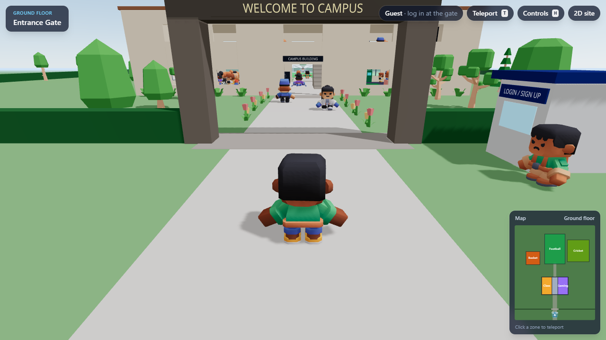
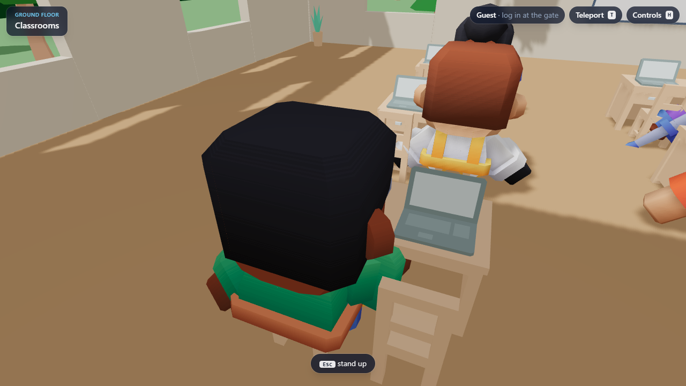
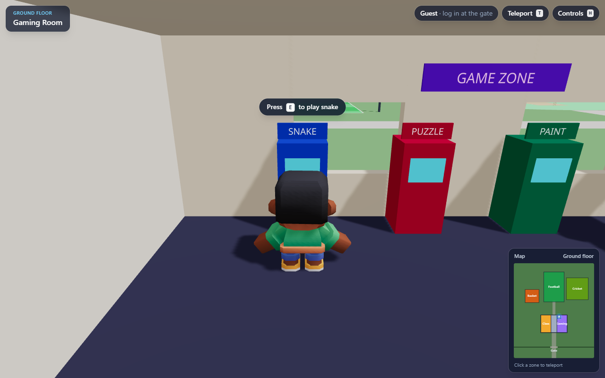
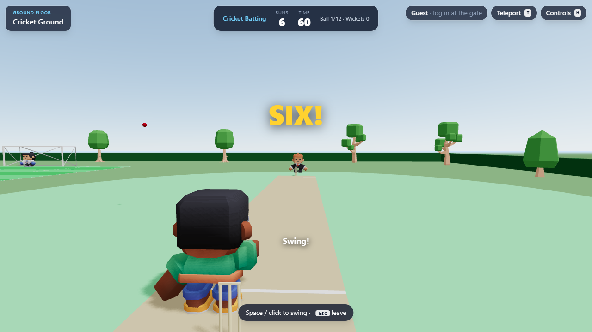
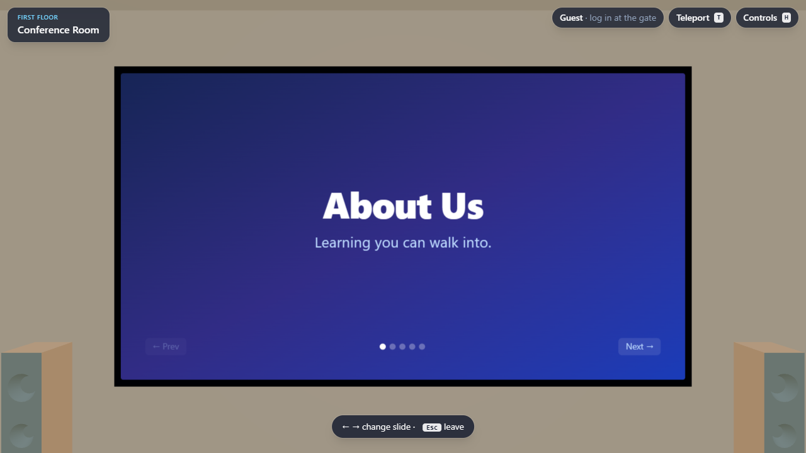

# Campus 3D

A browser-based, game-like 3D website: walk a character around a small campus, sit at a
classroom laptop to open courses, play arcade games in the gaming room, shoot hoops, take
penalties and bat in the cricket nets outside, and watch the "About us" deck on the
conference-room screen. Weak device or no WebGL? The same content is available as a
lightweight 2D site.

**Open source — contributions welcome.** Add a zone, a mini game, better art, or a real
backend. See [CONTRIBUTING.md](CONTRIBUTING.md).

| | |
|---|---|
|  |  |
|  |  |
|  |  |

## Features

- **Third-person character** with walk / run / jump / sit animations, a camera that never
  clips through walls, stairs, and physics (Rapier).
- **Campus zones**: entrance gate (login / sign-up with avatar picker), classrooms (sit down →
  Learning page), gaming room (Snake, Sliding Puzzle, Paint-by-Numbers with high scores),
  office (Request a Demo form, pricing), conference room (slides rendered on the 3D screen),
  outdoor sports (basketball, penalty shoot-out, cricket batting).
- **NPCs**: students typing at laptops, gamers on the sofa, walkers who stop and look at you.
- **HUD**: location, minimap (click to teleport), teleport menu, controls help.
- **Mobile**: virtual joystick, jump / interact buttons, pinch-to-zoom.
- **2D fallback**: the same courses, games, slides, pricing, demo form and account as
  ordinary web pages. It never downloads three.js.
- **Performance**: static geometry batching, adaptive quality (drops DPR and shadows on slow
  GPUs), code-split 3D engine, ~2.6 MB total download for the 3D campus.

## Quick start

Requires Node.js 20+.

```bash
npm install
npm run dev          # http://localhost:5173
```

| URL | What you get |
|---|---|
| `/` | 3D campus (or a 3D/2D chooser on weak devices) |
| `/?mode=2d` | the 2D site |
| `/?touch=1` | force the mobile touch controls on desktop |

Other scripts:

```bash
npm run build        # typecheck + production build → dist/
npm run preview      # serve the production build
npm run typecheck
npm run assets       # rebuild public/models/ from assets-src/ (after adding a model)
```

### Controls

| Keyboard / mouse | Action |
|---|---|
| W A S D / arrows | move (relative to the camera) |
| Shift | run |
| Space | jump |
| Drag / scroll | look around / zoom |
| E | interact (sit, play, open…) |
| Esc | close a panel, stand up, leave a game |
| T | teleport menu |
| H | controls help |

## Tech stack

Vite · React 19 · TypeScript · three.js · @react-three/fiber · @react-three/drei ·
@react-three/rapier · zustand · Tailwind CSS 4 · gltf-transform (asset pipeline).

## Project structure

```
src/
  Root.tsx, App3D.tsx   mode switch (3D / 2D / chooser) and the lazy 3D app
  site2d/               the 2D website
  world/                map layout, zones (gate, building, rooms, outdoor), static batching
  player/               character controller, third-person camera, teleport
  characters/, npc/     animated characters, seated and walking NPCs
  interactables/        reusable <Interactable> trigger + "Press E" prompt
  minigames/            Snake, Sliding Puzzle, Paint-by-Numbers, 3D sports
  ui/                   HUD, overlays (login, learning, office, arcade), loading, touch controls
  services/             auth, forms, scores — currently localStorage mocks
  content/              courses, pricing, slides — placeholder copy
assets-src/             raw CC0 models (Kenney) → `npm run assets` → public/models/
```

**[CLAUDE.md](CLAUDE.md)** is the detailed architecture guide: key decisions, the map in
meters, rules, and step-by-step recipes (add an interactable, overlay, zone, model, NPC or mini
game). Read it before larger changes.

## What's mocked (good first contributions)

- **Auth** (`src/services/auth.ts`): localStorage mock. A Supabase mapping is sketched in the TODO.
- **High scores / learning progress** (`src/services/scores.ts`, `LearningOverlay`): localStorage.
- **Request a Demo** (`src/services/forms.ts`): logs to the console. Needs a serverless endpoint + email.
- **Content** (`src/content/`): courses, pricing and the team slide are placeholders.

## Credits

3D models: [Kenney](https://kenney.nl) — Mini Characters, Furniture Kit, Nature Kit (CC0).
Licenses are included in `assets-src/`.

## License

[MIT](LICENSE) for the code. Assets in `assets-src/` and `public/models/` are CC0 (Kenney).
