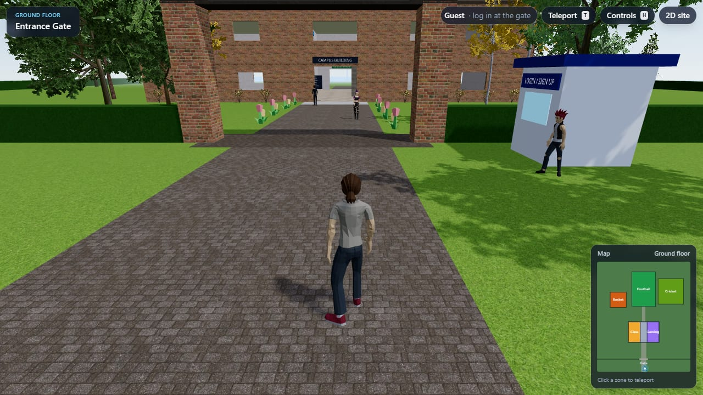
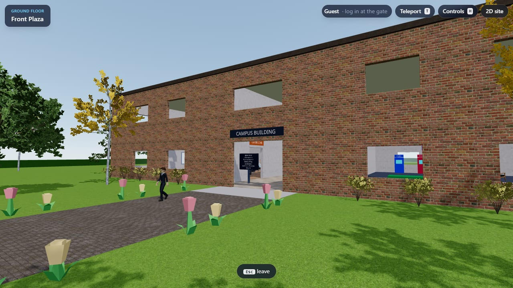
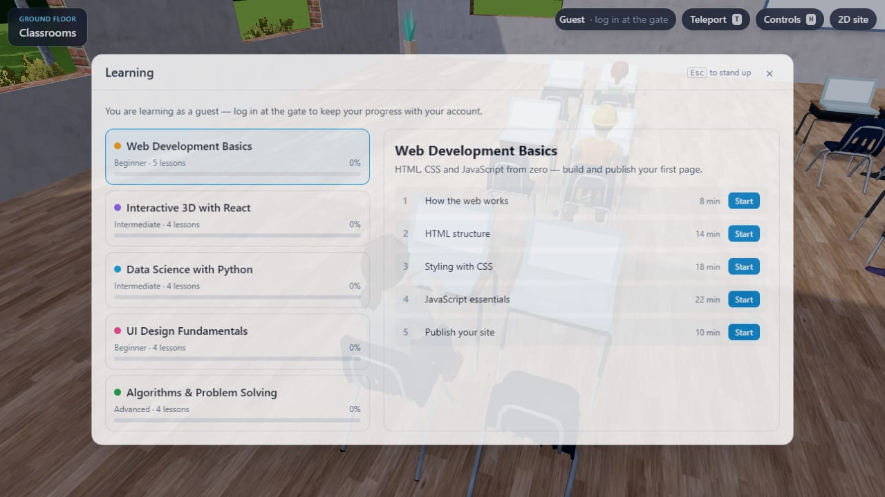
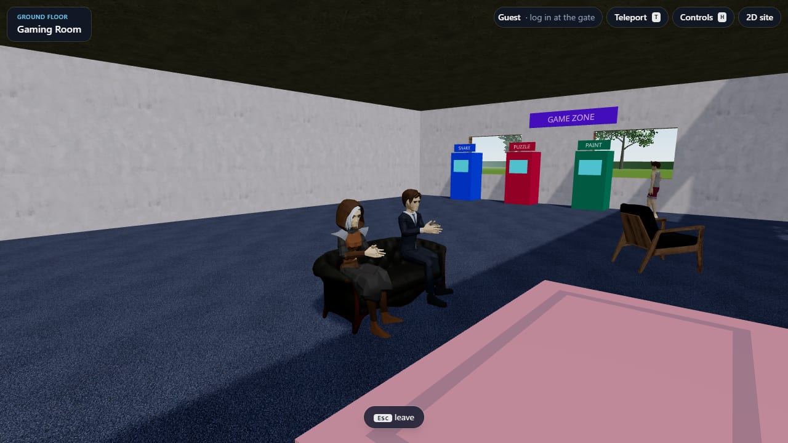
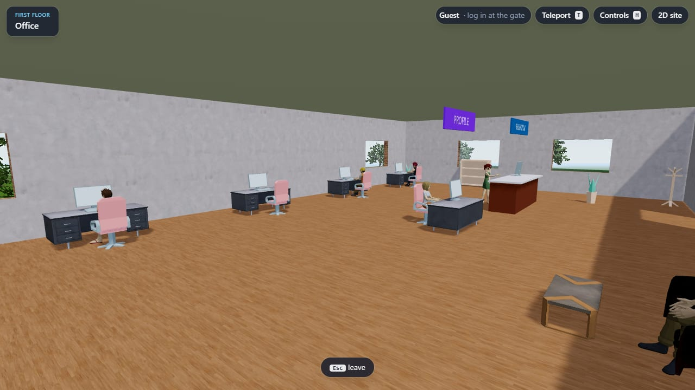
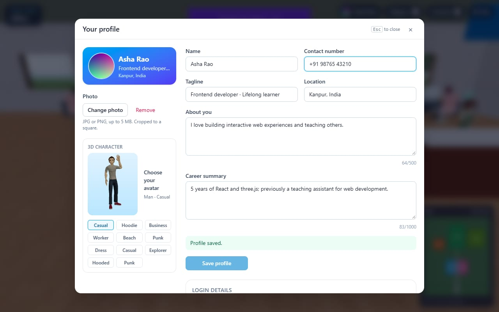
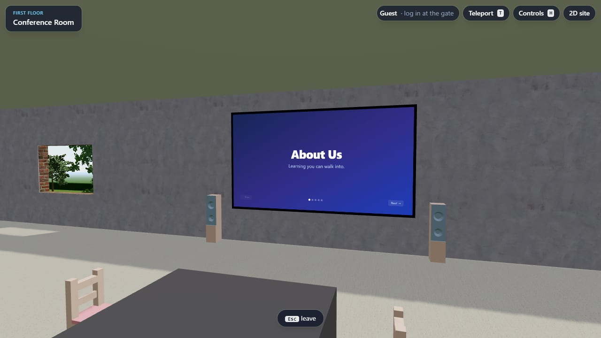
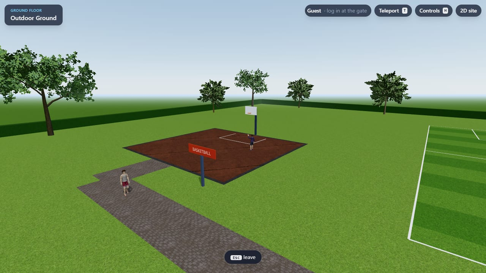
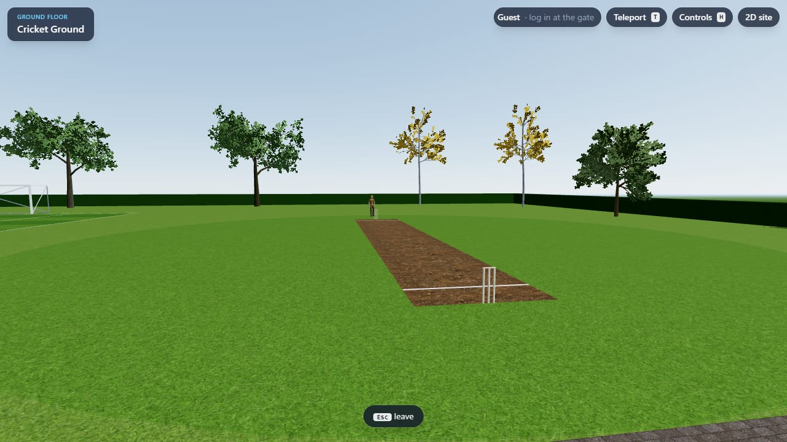
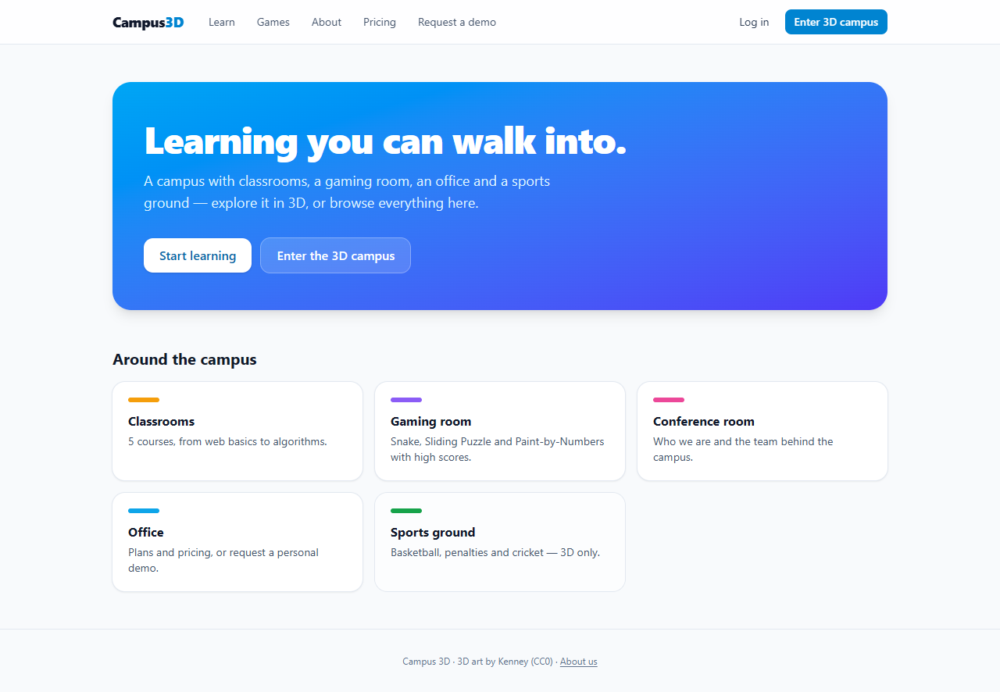

# Campus 3D

A website you can walk around. Visitors control a character on a small 3D campus, sign up at
the gate, sit down at a classroom laptop to open courses, play arcade games, shoot hoops,
take penalties, bat in the cricket nets, edit their profile at the office desk and watch the
"About us" deck on the conference-room screen.

It runs in the browser with no install or plugin. On weak devices or without WebGL, the same
content is served as a lightweight 2D site.

**Open source, and contributions are welcome:** a new zone, a mini game, better art or a real
backend. See [CONTRIBUTING.md](CONTRIBUTING.md) and the [roadmap](#roadmap).

| | |
|---|---|
|  |  |
|  |  |
|  |  |
|  |  |
|  |  |

## What you can do

| Place | What happens |
|---|---|
| **Entrance gate** | Log in or sign up (email + password) at the booth. |
| **Classrooms** | Sit at the free desk; the laptop opens the **Learning** page (courses, lessons, progress). |
| **Gaming room** | Arcade cabinets and a console: **Snake**, **Sliding Puzzle**, **Paint-by-Numbers**, with per-user high scores and a leaderboard. |
| **Office (1st floor)** | Reception: **Request a demo** form and **pricing**. **PROFILE desk**: photo, name, contact number, tagline, location, about, career summary, 3D avatar, change email / password. |
| **Conference room** | Slides rendered on the wall screen (← → to change slide). |
| **With others** | See other visitors walk around with name tags, chat (Enter), send emotes (1–4), and press E next to someone to view their profile card. |
| **Anywhere** | A **guided tour** for first-time visitors (six steps, a glowing beacon and an arrow at your feet), and **Settings** for sound and **day / sunset / night**. |
| **Outdoor ground** | **Basketball** (aim + power meters, real ball physics), **football penalties** against a diving keeper, **cricket batting** with timing (SIX / FOUR / edge). Rounds are 30–60 s. |

Students type at laptops, gamers play on the sofa, office staff work at desks, and people
walk around and stop to look at you.

## Features

- **Third-person character**: walk, run, jump and sit, with a camera that never clips through
  walls, plus stairs and Rapier physics. Choose from 11 human avatars.
- **Semi-realistic look**:
  - Brick, plaster, tile, wood and carpet surfaces; grass, pavers and asphalt outside
    (CC0 PBR textures).
  - Sky-based lighting, real furniture models and procedurally generated trees.
  - Characters are Quaternius CC0 humans. Their sitting / typing / gaming / jumping poses are
    generated in code.
- **Guided first visit**: an optional six-step tour (sign up, sit in class, play a game and a
  sport, set up your profile, watch the presentation) with a light beacon at each goal, an
  arrow that routes you through doors and up the stairs, "take me there", and saved progress.
- **Sound**:
  - Footsteps that change with the floor (grass, paving, wood, carpet).
  - Ball, bat, rim and net sounds; UI clicks.
  - Synthesised ambience: wind, birds by day, crickets at night, muffled indoors.
  - Mute button and volume in Settings.
- **Day, sunset and night**:
  - Sky, sun / moon and fog fade between times of day.
  - Street lamps light the paths at night, and the room lights come on indoors.
  - "My clock" follows your local time.
- **Multiplayer presence** (optional server):
  - Other visitors with name tags, chat, emotes and opt-in profile cards.
  - Shown in the "N online" panel and as dots on the minimap.
  - Privacy switches: hide yourself, share your card or not, hide chat. Phone and email are
    never shared.
  - Runs on a tiny WebSocket relay in [`server/`](server/README.md).
- **HUD**:
  - Current location and a minimap (click to teleport).
  - Teleport menu (T) and controls help (H).
  - User chip with your profile photo.
- **Accounts and profile**:
  - Email + password signup. Passwords are hashed with PBKDF2 and never stored in plain text.
  - Profile with photo upload (cropped to 256×256) and an unsaved-changes guard.
  - Note: this is currently a browser-only mock; see [Status](#status-whats-mocked).
- **Mobile**: virtual joystick, jump / interact buttons, pinch-to-zoom.
- **2D fallback**: the same courses, games, slides, pricing, demo form, account and profile as
  ordinary web pages. It never downloads three.js (~80 KB gzip).
- **Performance**:
  - Static geometry is batched into instanced meshes, split into 32 m cells so it can be
    frustum-culled.
  - Zones you can't see are hidden, and the shadow map renders on demand.
  - NPCs use distance-based animation LOD, and each character is a single draw call.
  - Adaptive quality: lower resolution and no shadows on slow GPUs.
  - Code-split 3D engine. A built-in `?bench=1` benchmark.

## Quick start

Requires **Node.js 20+**.

```bash
git clone https://github.com/DarkDominic456/campus-3d.git
cd campus-3d
npm install
npm run dev          # http://localhost:5173
```

| URL | What you get |
|---|---|
| `/` | 3D campus (or a 3D / 2D chooser on weak devices) |
| `/?mode=3d` · `/?mode=2d` | force the 3D campus or the 2D site |
| `/?touch=1` | mobile touch controls on desktop |
| `/?bench=1` | benchmark: visits fixed spots and shows fps, draw calls and triangles |

### Multiplayer

There are three ways to run it:

- **Without a server, in dev:** open the campus in two tabs of the same browser. "Local
  mode" connects them.
- **With a real server, locally:**
  1. Run `npm run server`.
  2. Put `VITE_MULTIPLAYER_URL=ws://localhost:8787` in `.env.local`.
  3. Restart `npm run dev`.
- **On the live site:** host `server/` on any Node host that keeps WebSockets open, such as
  Render, Fly or Railway. Then set `VITE_MULTIPLAYER_URL=wss://…` in Vercel. Steps are in
  [server/README.md](server/README.md).

Without a URL, production builds hide multiplayer.

### Controls

| Keyboard / mouse | Action |
|---|---|
| W A S D / arrows | move (relative to the camera) |
| Shift | run |
| Space | jump |
| Drag / scroll | look around / zoom |
| E | interact (sit, play, open…) |
| Esc | close a panel, stand up, leave a game |
| T | teleport menu |
| H | controls help |

On phones: left joystick to move (push fully to run), drag to look, pinch to zoom, and the
on-screen Jump / Interact buttons.

### Scripts

```bash
npm run dev          # dev server
npm run build        # typecheck + production build → dist/
npm run preview      # serve the production build
npm run typecheck
npm run assets       # rebuild public/models, public/textures and the sky light probe
node scripts/fetch-sources.mjs [textures] [hdri] [models] [characters] [audio]
                     # download the (git-ignored) CC0 sources the asset pipeline needs
```

You only need the last two when you change art. The built outputs in `public/` are committed,
so `npm install && npm run dev` is enough to run the project.

## Tech stack

Vite · React 19 · TypeScript · three.js · @react-three/fiber · @react-three/drei ·
@react-three/rapier · zustand · Tailwind CSS 4. Asset pipeline: gltf-transform, meshoptimizer,
sharp, EZ-Tree.

Download size of the 3D campus:
- ~1.2 MB of gzipped JavaScript, two-thirds of it the Rapier physics engine.
- ~3.3 MB of models and textures.

## How it is built

```
src/
  main.tsx → Root.tsx   picks the experience: 3D, 2D or a chooser (WebGL / weak-device detection)
  App3D.tsx             the lazy-loaded 3D app: <Canvas> + HUD, overlays, loading screen
  site2d/               the 2D website (hash routes: #/learn, #/games, #/profile …)
  world/                map layout (layout.ts, zoneConfig.ts), zones, lights, visibility layers,
                        static batching (parts/Batch.tsx), textured surfaces (parts/surfaces.ts)
  player/               kinematic character controller, third-person camera, teleport
  characters/           animated characters, clip mapping, procedural poses (poses.ts)
  npc/                  seated and walking NPCs
  interactables/        <Interactable> trigger + "Press E" prompt, global key handling
  minigames/            Snake, Sliding Puzzle, Paint-by-Numbers, 3D sports
  ui/                   HUD, minimap, overlays (auth, profile, learning, office, arcade), touch
  services/             auth, scores, forms: interfaces + localStorage mocks
  content/              courses, pricing, slides (placeholder copy, edit freely)
scripts/                asset pipeline (build-assets.mjs, build-trees.mjs, fetch-sources.mjs)
assets-src/             raw Kenney CC0 packs (other sources are downloaded, see above)
public/models, public/textures   generated, compressed assets
```

**[CLAUDE.md](CLAUDE.md)** is the detailed architecture guide. It covers:
- key decisions and why they were made;
- the map in meters, and the rules;
- step-by-step recipes for adding an interactable, overlay, zone, model, NPC or mini game.

Read it before larger changes.

## Status: what's mocked

The site works end to end, but these parts run in the browser only. They are good first
contributions:

- **Accounts and profiles** (`src/services/auth.ts`): stored in `localStorage` with hashed
  passwords. Data stays on one device and there's no email verification or password reset.
  A Supabase mapping (auth, `profiles` table, `avatars` bucket) is sketched in the file.
- **High scores and learning progress** (`src/services/scores.ts`, `LearningOverlay`):
  `localStorage`, so there's no global leaderboard yet.
- **Request a demo** (`src/services/forms.ts`): logs to the console. It needs a serverless
  endpoint and an email provider.
- **Content** (`src/content/`): courses, pricing and the team slide are placeholders.

## Roadmap

Ideas that would make the campus more useful. Issues and PRs welcome.

1. **Real backend (Supabase)**: accounts that work across devices, email verification /
   password reset, profile photos in storage, global leaderboards, demo requests delivered by
   email.
2. **Real learning content**: video or text lessons, quizzes, progress synced to the account,
   and completion certificates; content editable from JSON or a headless CMS.
3. ~~**Multiplayer presence**~~: done (Phase 9). It needs the server hosted for the live site.
4. **Profiles in the world**: the visitor card is done (Phase 9). Still open: a 3D leaderboard
   in the gaming room and public profile pages (these need the backend).
5. **Live sessions**: the conference room as a real meeting space (scheduled talks, screen
   sharing, a video embed on the wall screen).
6. ~~**Guided first visit**, audio and day / night~~: done (Phase 8).
7. **Accessibility and reach**: keyboard-only and screen-reader friendly overlays, Hindi /
   English (i18n), installable PWA, better low-end mobile performance.
8. **Sharing and analytics**: real URLs and Open Graph previews for 2D pages, plus
   privacy-friendly analytics (Plausible / Umami) to see which zones people use.
9. **Contributor experience**: Playwright end-to-end tests in CI, and a zone / plugin structure
   so new rooms are self-contained.

## Deploying

`npm run build` produces a static site in `dist/`. `vercel.json` sets the cache headers
(hashed `/assets` long-lived, `/models` for one day). Routing is hash-based, so any static
host works. On Vercel, import the GitHub repo and it deploys on every push to `main`.

## Credits

- Characters: [Quaternius](https://quaternius.com), Ultimate Modular Men / Women (CC0, via
  [poly.pizza](https://poly.pizza)).
- Furniture: [Poly Haven](https://polyhaven.com) (CC0) and the [Kenney](https://kenney.nl)
  Furniture Kit (CC0).
- Textures: [Poly Haven](https://polyhaven.com) and [ambientCG](https://ambientcg.com) (CC0).
  The sky light is baked from a Poly Haven HDRI.
- Trees: generated with [EZ-Tree](https://github.com/dgreenheck/ez-tree) by Daniel Greenheck
  (MIT). Its bark textures are CC0.
- Flowers and small props: [Kenney](https://kenney.nl) Nature Kit (CC0).
- Sound effects: [Kenney](https://kenney.nl) Impact Sounds and Interface Sounds (CC0). The
  ambience is synthesised in the browser.

Kenney licenses are in `assets-src/`. The other sources are downloaded by
`node scripts/fetch-sources.mjs`, each with a `SOURCE.txt`.

## License

[MIT](LICENSE) for the code. Assets in `assets-src/`, `public/models/` and `public/textures/`
are CC0, except the EZ-Tree-generated trees (MIT).
